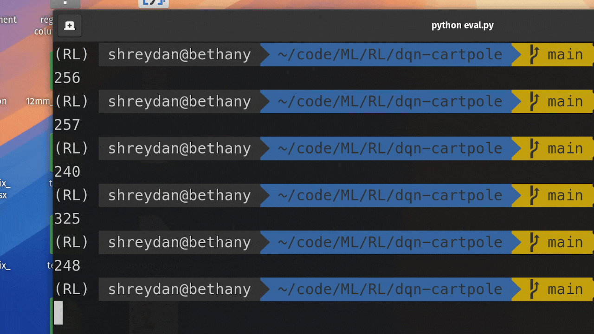

# Reinforcement Learning

requirements: `numpy matplotlib pygame tqdm torch gymnasium`

# Implementations

- [Simple Q Learning](./qtreats/)
  - Q-table based policy
  - implemented treats game in pygame, where the goal of the agent(dog) is to reach the treat while avoiding the cats {width=300}

- [Deep Q Learning](./dqn-cartpole/)
- DQN based policy
- implemented vanilla DQN and double DQN training for the cartpole env from gymnasium
{width=300}


---

```
Teach me thy way, O Lord; I will walk in thy truth: unite my heart to fear thy name
Psalm 86:11
```