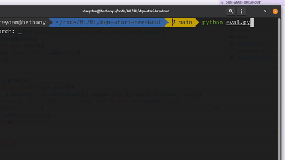

# Reinforcement Learning

requirements: `numpy matplotlib pygame tqdm torch gymnasium`

# Implementations

- [Simple Q Learning](./qtreats/)
  - Q-table based policy
  - implemented treats game in pygame, where the goal of the agent(dog) is to reach the treat while avoiding the cats
  

- [Deep Q Learning](./dqn-cartpole/)
  - DQN based policy
  - implemented vanilla DQN and double DQN training for the cartpole env from gymnasium


- [ATARI: Deep Q Learning](./dqn-atari-breakout/)
  - playing ATARI breakout with double DQN
  - implemented frame buffer with openCV frame preprocessing and memory-efficient replay buffer from scratch.
  - Used Gymnasium's `SyncVectorEnv` to train in a kaggle env. with 8 game environments all running in parallel which quickly fills up enough replay-buffer for good training.
  - Updated the frame-buffer and replay-buffer to handle multiple envs at once.
  - All the code is available with outputs in [this notebook](./dqn-atari-breakout/full_code.ipynb)
  - Good starter results with only 5 hours of training.

---

```
Teach me thy way, O Lord; I will walk in thy truth: unite my heart to fear thy name
Psalm 86:11
```